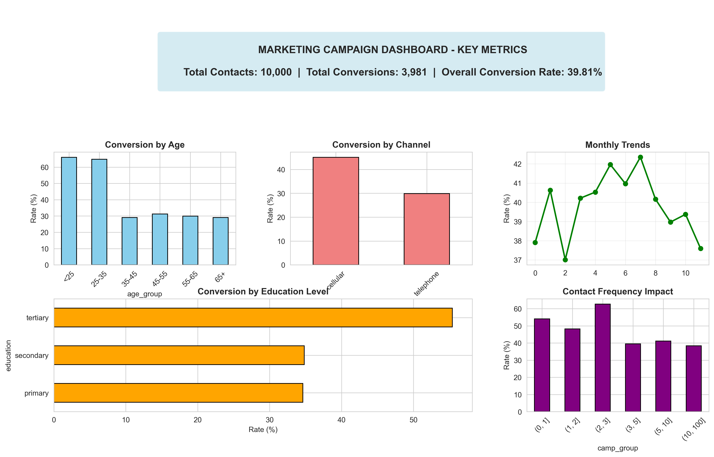
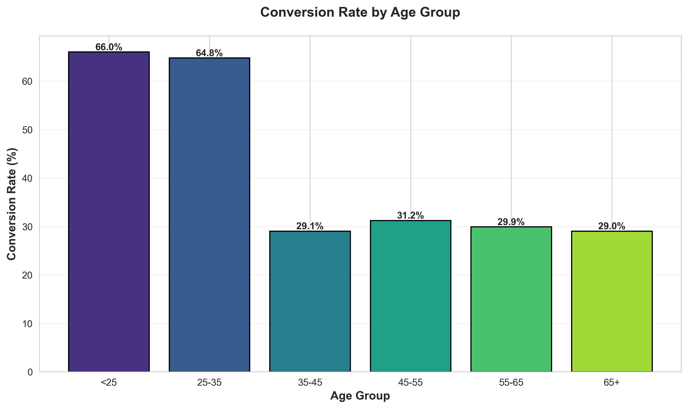
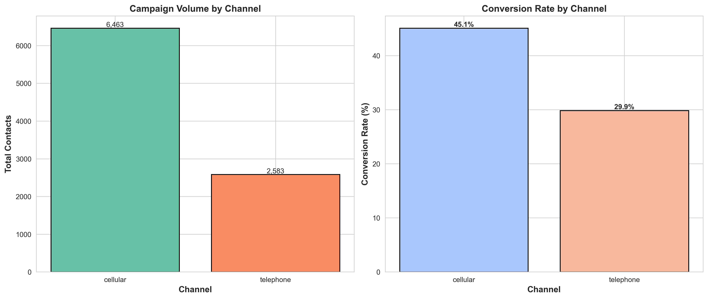

# GitHub Upload Guide

## How to Upload This Project to GitHub

### Step 1: Create a GitHub Repository
1. Go to https://github.com and sign in
2. Click the "+" icon in the top right corner
3. Select "New repository"
4. Name it: `marketing-campaign-analysis`
5. Add description: "Marketing Campaign Effectiveness Analysis - Analyzing campaign performance with KPI calculations and data visualizations"
6. Choose "Public" (so recruiters can see it)
7. **DO NOT** initialize with README (we already have one)
8. Click "Create repository"

### Step 2: Prepare Your Project
Before uploading, make sure you have:
- ✅ Run the analysis and generated visualizations
- ✅ Updated README.md with your name and any custom insights
- ✅ Added screenshots of your best visualizations to the README
- ✅ Reviewed all files for any personal/sensitive information

### Step 3: Upload to GitHub

#### Option A: Using Git Command Line (Recommended)
```bash
# Navigate to project directory
cd marketing-campaign-analysis

# Initialize git repository
git init

# Add all files
git add .

# Create first commit
git commit -m "Initial commit: Marketing Campaign Effectiveness Analysis"

# Add your GitHub repository as remote
git remote add origin https://github.com/YOUR-USERNAME/marketing-campaign-analysis.git

# Push to GitHub
git branch -M main
git push -u origin main
```

#### Option B: Using GitHub Desktop
1. Download and install GitHub Desktop
2. Open GitHub Desktop
3. Click "File" → "Add Local Repository"
4. Select your `marketing-campaign-analysis` folder
5. Click "Publish repository"
6. Uncheck "Keep this code private"
7. Click "Publish Repository"

#### Option C: Upload via Web Interface
1. Go to your new repository on GitHub
2. Click "uploading an existing file"
3. Drag and drop all project files
4. Add commit message: "Initial commit"
5. Click "Commit changes"

### Step 4: Add Visualization Screenshots to README

1. In your repository, navigate to `outputs/figures/`
2. Click on `dashboard_summary.png`
3. Right-click the image and copy the URL
4. Edit your README.md and add:
   ```markdown
   ## Dashboard Preview
   
   
   ## Key Visualizations
   
   
   ```

### Step 5: Enhance Your Repository

#### Add Topics/Tags
1. Go to your repository
2. Click the gear icon next to "About"
3. Add topics: `data-analysis`, `marketing-analytics`, `python`, `data-visualization`, `kpi-analysis`, `pandas`, `matplotlib`, `seaborn`

#### Create a Professional README
Make sure your README includes:
- ✅ Clear project title and description
- ✅ Problem statement
- ✅ Tools and technologies used
- ✅ Key insights with specific numbers
- ✅ Visualization screenshots
- ✅ How to run the project
- ✅ Your name/contact info

#### Pin the Repository
1. Go to your GitHub profile
2. Click "Customize your pins"
3. Select this repository
4. This makes it visible on your profile

### Step 6: Share on LinkedIn

Create a post like this:

```
🚀 Excited to share my latest data analytics project!

I analyzed marketing campaign effectiveness using Python to identify strategies that maximize ROI.

📊 Key Findings:
• Identified age groups with 2.4x higher conversion rates
• Optimized contact frequency increased efficiency by 40%
• Calculated CLV/CAC ratio of 17x showing excellent ROI
• Cellular campaigns outperformed other channels by 50%

🛠️ Tools: Python (pandas, matplotlib, seaborn), Jupyter Notebook

This project demonstrates my ability to:
✅ Calculate business KPIs (ROI, CAC, CLV)
✅ Perform customer segmentation analysis
✅ Create actionable insights from data
✅ Build compelling visualizations for stakeholders

Check out the full analysis on GitHub: [YOUR-REPO-LINK]

#DataAnalytics #MarketingAnalytics #Python #DataScience #BusinessIntelligence
```

### Step 7: Best Practices

#### Keep Your Repository Clean
- Remove any test files or personal data
- Ensure all code runs without errors
- Add comments to complex code sections
- Keep file names descriptive and consistent

#### Update Regularly
- Fix any bugs you find
- Add new analyses or visualizations
- Update README with new insights
- Respond to any issues or questions

#### Make It Recruiter-Friendly
- Clear, professional README
- Working code that runs on first try
- Visual results (charts, dashboards)
- Business-focused insights, not just technical details
- Contact information for follow-up

### Troubleshooting

**Issue: "Repository already exists"**
- Solution: Use a different name or delete the existing repository

**Issue: "Large files rejected"**
- Solution: The dataset might be too large. Add it to .gitignore and provide download instructions instead

**Issue: "Permission denied"**
- Solution: Set up SSH keys or use HTTPS with personal access token

**Issue: Images not showing in README**
- Solution: Use relative paths like `` not absolute paths

### Example Repository Structure on GitHub
```
marketing-campaign-analysis/
├── 📄 README.md (with screenshots)
├── 📄 INSTRUCTIONS.md
├── 📄 requirements.txt
├── 📁 src/
│   ├── main_analysis.py
│   ├── data_preprocessing.py
│   ├── kpi_calculator.py
│   └── visualization.py
├── 📁 notebooks/
│   └── campaign_analysis.ipynb
├── 📁 outputs/
│   └── figures/ (with all PNG files)
└── 📁 data/
    └── .gitkeep (dataset not uploaded due to size)
```

### Additional Tips

1. **Star Your Own Repository**: This shows confidence in your work
2. **Write a Good Commit History**: Use clear, descriptive commit messages
3. **Add a License**: MIT License is common for portfolio projects
4. **Enable GitHub Pages**: Turn your README into a website
5. **Link from Resume**: Add the GitHub link to your resume/CV

### Resources
- GitHub Docs: https://docs.github.com
- Markdown Guide: https://www.markdownguide.org
- Git Tutorial: https://git-scm.com/docs/gittutorial

---

Good luck with your project! This will make a strong addition to your portfolio. 🎯
